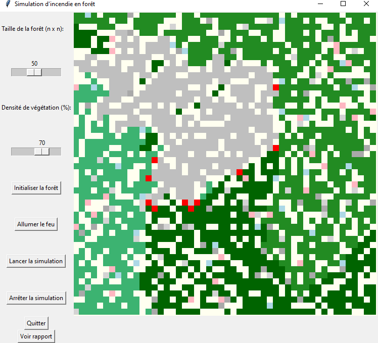

# Analyse du Code de Simulation d'Incendie



## Analyse du Code

### 1. Importations et Déclarations Initiales
Le code commence par importer plusieurs bibliothèques essentielles :
- **random** : pour la génération aléatoire.
- **tkinter** : pour la création de l'interface graphique.
- **matplotlib.pyplot** : pour la visualisation graphique des données.
- **numpy** : pour la gestion des tableaux et des opérations numériques.
- **noise** : pour la génération de bruit de Perlin, utilisé dans la création de paysages variés.

Un dictionnaire `PROPERTIES` définit les caractéristiques de différents types d'arbres et de bâtiments, incluant des propriétés telles que la couleur, l'inflammabilité, et, pour certains, leur valeur d'assurance.

### 2. Paramètres Météorologiques
Les paramètres météorologiques initiaux incluent :
- **Vitesse du vent** : influençant la direction et la vitesse de propagation du feu.
- **Humidité** : affectant la combustion des végétaux.
- **Température** : impactant l'inflammabilité.
- **Direction du vent** : essentielle pour la simulation de la propagation du feu.

### 3. Fonctions de Génération
Le code comprend plusieurs fonctions clés pour générer les éléments de la simulation :
- **`generate_slope_field`** : Crée un champ de pente, introduisant des collines qui influencent la propagation des incendies par l'inclinaison du terrain.
- **`generate_biome_map`** : Produit une carte des biomes à l'aide du bruit de Perlin, servant à déterminer quel type de végétation peut se développer dans une zone donnée.
- **`random_forest`** : Génère une forêt en ajoutant des arbres et des bâtiments selon la densité végétale spécifiée et les types de biomes.

### 4. Fonctions de Simulation
Les fonctions principales de simulation incluent :
- **`update_states`** : Met à jour l'état des cellules dans la grille de simulation, gérant la propagation du feu en vérifiant les cellules voisines et en tenant compte de l'inclinaison du terrain.
- **`step`** : Effectue une étape de simulation, appelant `update_states` et rafraîchissant l'affichage.
- **`animation`** et **`stop`** : Gèrent le démarrage et l'arrêt de la simulation.

### 5. Interface Utilisateur
L'interface est construite avec `tkinter`, permettant à l'utilisateur de :
- Définir la taille de la forêt.
- Ajuster la densité de végétation.
- Initier l'incendie et lancer la simulation.

Un rapport final est généré à la fin de la simulation, affichant le nombre de bâtiments détruits et la valeur totale des destructions.

## Modélisations Physiques

### Propagation du feu
Le modèle utilise les propriétés d'inflammabilité des différents types de végétation et l'inclinaison du terrain pour déterminer la probabilité de propagation du feu.

### Influence de l'environnement
Le code tient compte de la pente, du type de sol, et de la densité de végétation, ce qui reflète des conditions réalistes pour la propagation des incendies dans les forêts.

## Utilisation du Code

### Installation des Dépendances
Assurez-vous d'installer les bibliothèques nécessaires avec la commande suivante :
```bash
pip install numpy noise matplotlib
